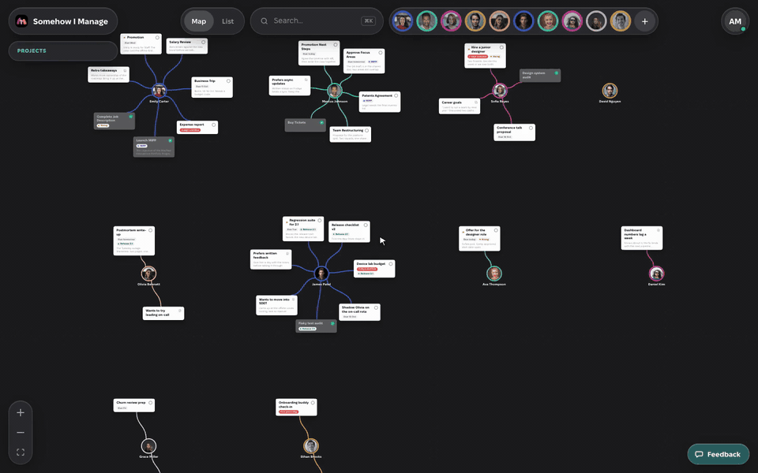
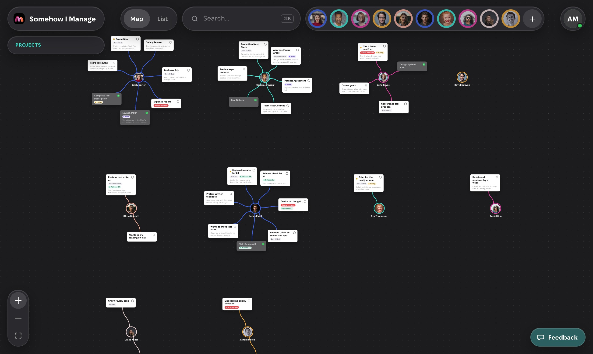
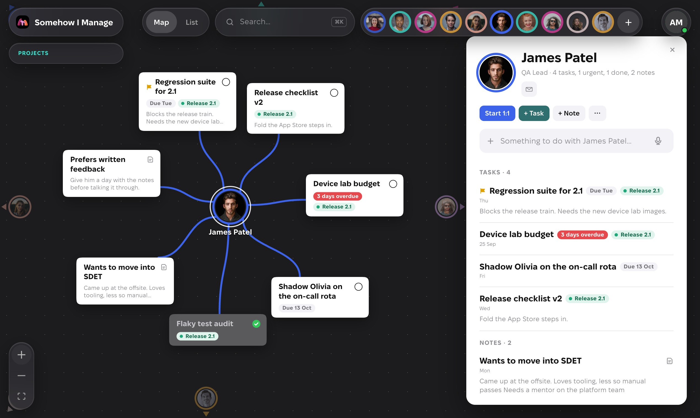
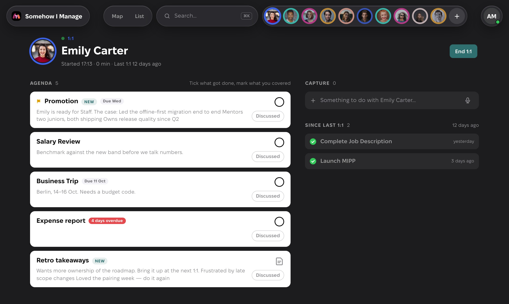
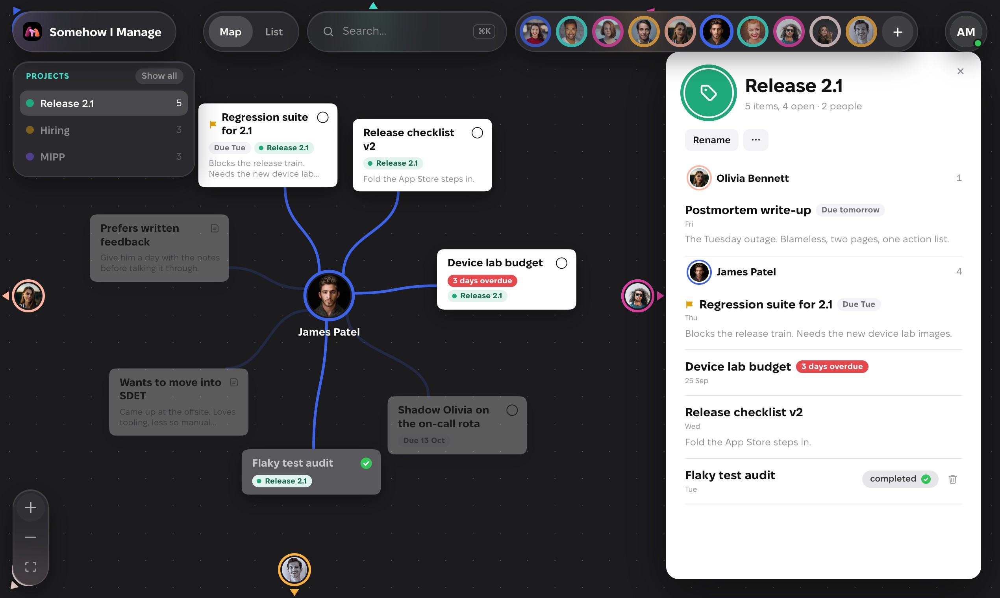

<p align="center">
  
</p>

<h1 align="center">Somehow I Manage</h1>

<p align="center">
  <strong>Work with people, not tasks.</strong><br />
  A people-first task manager for managers. Free, offline-first, open source.
</p>

<p align="center">
  <a href="https://somehowimanage.app">somehowimanage.app</a> ·
  <a href="https://somehowimanage.app/mcp/">connect an AI assistant</a> ·
  <a href="https://somehowimanage.app/privacy/">privacy</a>
</p>

<p align="center">
  <a href="https://github.com/Krivoblotsky/somehow-i-manage/actions/workflows/ci.yml"></a>
  <a href="LICENSE"></a>
</p>

<p align="center">
  
</p>

## Why

Managers don't have tasks. They have people. Most task managers start from a list or a project;
a manager's week starts from Vira, Anton and Nata: what I owe them, what they told me, what to
raise on Thursday. So managers keep a dossier per person in Apple Notes, Sheets or Jira, in tools
never meant for it.

Somehow I Manage is that habit turned into a tool. The **person is the root object**. Tasks are
things you have to do _with_ someone, notes are things to remember _about_ them, and the whole
team sits on one map.

## What it does

<table>
  <tr>
    <td width="50%"></td>
    <td width="50%"></td>
  </tr>
  <tr>
    <td></td>
    <td></td>
  </tr>
</table>

- **People Map.** Every person is a hub with a coloured ring; their tasks and notes are cards
  around them. Drag a card onto someone else to hand it over. People out of view stay pinned at
  the edge; one click flies to them.
- **1:1 mode.** Start a 1:1 from someone's page and the agenda is what's open, urgent first. Tick
  what got done, mark what you discussed, capture new things as they come up. Ending the meeting
  records it; the next one shows what happened since.
- **Capture in five seconds.** A line on the person's card, ⌘K from anywhere (`Vira: ask about
the offsite` adds a task), paste a whole list, or press the microphone and dictate.
- **Projects.** An optional tag that cuts across people. Cards show it; the Projects island counts
  what hangs on each project and spotlights one on the map.
- **@people and #tasks in the text.** Type `@` in a note to link a colleague (or add a new one on
  the spot) and `#` to link another task or note. Mentions are clickable everywhere, a person's
  page lists where else they come up, and the map keeps mentioning cards lit when you spotlight
  someone.
- **Due dates, urgent flags, rich notes, search, undo**, keyboard shortcuts, a Markdown export
  and JSON backups.
- **Agentic AI friendly.** An MCP server lets Claude, ChatGPT, Cursor, VS Code or Claude Code
  work with your people as you: "what is open with Vira?", "prepare my 1:1 with Anton", "add a
  task with Emily". One address, approved once. See [docs/MCP.md](docs/MCP.md).
- **Offline-first.** Your data lives in your browser (IndexedDB) and syncs through your own
  account (Google, Microsoft or a passkey). Works on a plane, installs as an app, exports in one
  click, deletes in one more.

## Try it

Open <https://somehowimanage.app>. The map in the hero is the real thing with a sample team: tick
a task, drag a card, press + on a person. Sign in to keep your own.

## Connect an AI assistant

Give any MCP client this address and it will ask you to sign in and approve it once:

```
https://mvpbxmlczninyqsyjhqh.supabase.co/functions/v1/mcp
```

For Claude Code: `claude mcp add --transport http somehow-i-manage <that address>`, then `/mcp`.
Fourteen tools, from `list_people` and `prepare_one_on_one` to `add_task` and `move_item`; the
assistant acts as you, under the same access rules as the app. Details and the server's code:
[docs/MCP.md](docs/MCP.md), [`supabase/functions/mcp/`](supabase/functions/mcp/).

## How it is built

- **React 19 + TypeScript**, Vite, Vitest, ESLint, Prettier. Strict types, ~200 tests.
- **Local-first.** Dexie (IndexedDB) is the only thing the UI reads and writes. A change-log
  middleware notes every change in an outbox; a small sync engine pulls by sequence number and
  pushes the outbox to **Supabase** (one JSON row per record, last write wins, row-level security
  per account, Realtime nudges other devices). The engine is tested against a fake server.
- **The map** is React Flow with positions stored as data, so nothing jumps when you delete or
  move a card. Layout, edge geometry and the graph builder are pure modules with tests.
- **Rich text** is TipTap; **dictation** is the browser's own speech recognition.
- **Auth** is Supabase Auth: Google, Microsoft, passkeys. Supabase Auth is also the OAuth 2.1
  server for the MCP clients; the consent screen is in the app.
- **The MCP server** is a Supabase Edge Function (Deno) using the official MCP SDK and
  `@supabase/server`; it reads and writes the same records the devices sync.
- **PWA** with a service worker that asks before switching versions; the landing page is
  pre-rendered at build time for crawlers and first paint.

```
src/
  model/        types, palette, derived values, formatting, projects, calendar logic — pure, tested
  data/         Dexie database, repository (every read and write), sample data, backups, export
  map/          People Map geometry: ring layout, cluster grid, edge endpoints, graph builder
  state/        UI state (zustand), toasts, dictation, projects hooks
  sync/         outbox middleware, sync engine, Supabase transport and auth, OAuth consent
  marketing/    first-party attribution and the two in-app questions (no third-party analytics)
  components/   the app: Header, PeopleMap, PersonPanel, ItemPanel, OneOnOne, ProjectPanel,
                CommandPalette, LandingPage, SyncDialog, OAuthConsent …
supabase/
  schema.sql    tables, functions and policies: run once in the SQL editor
  functions/mcp the MCP server (Deno)
docs/           product, design, plan, sync setup, MCP, calendar draft, launch plan
scripts/        screenshots, icons, social card, launch assets, pre-render
```

## Run it yourself

You need Node 22 or newer and a free [Supabase](https://supabase.com) project.

```bash
git clone https://github.com/Krivoblotsky/somehow-i-manage.git
cd somehow-i-manage
npm install
cp .env.example .env.local   # fill in VITE_SUPABASE_URL and VITE_SUPABASE_ANON_KEY
npm run dev                  # http://localhost:5173
```

Without the two variables the build shows a setup notice instead of signing anyone in.
[docs/SYNC.md](docs/SYNC.md) is the ten-minute walkthrough: create the project, run
`supabase/schema.sql`, enable Google and Microsoft sign-in, set the URLs. [docs/MCP.md](docs/MCP.md)
adds the OAuth server and deploys the MCP function. The Google Calendar integration is drafted and
parked on the `calendar` branch ([docs/CALENDAR.md](docs/CALENDAR.md)).

| Script                  | What it does                                                       |
| ----------------------- | ------------------------------------------------------------------ |
| `npm run dev`           | Vite dev server with HMR                                           |
| `npm test`              | Vitest (jsdom, fake IndexedDB)                                     |
| `npm run lint`          | ESLint                                                             |
| `npm run typecheck`     | `tsc -b`                                                           |
| `npm run build`         | type-check, production build, pre-rendered landing page in `dist/` |
| `npm run format`        | Prettier                                                           |
| `npm run shots`         | re-take the landing page screenshots from the dev server           |
| `npm run icons`         | render the app icons from `assets/icon-source.png`                 |
| `npm run og`            | compose the social preview image                                   |
| `npm run launch-assets` | Product Hunt frames and the demo video                             |

The MCP server has its own tests under Deno (no install needed):

```bash
npx -y deno test -A --config supabase/functions/deno.json supabase/functions/mcp/
```

## Deploy

Pushing to `main` builds and publishes to GitHub Pages (`.github/workflows/deploy.yml`); the
Supabase URL and anon key come from repository variables. Any static host works: build with
`BASE_PATH=/ npm run build` and serve `dist/`. Static pages next to the app (`/privacy/`, `/mcp/`,
the OAuth consent redirect) live in `public/`.

## Privacy

Only you can read your data: it lives on your device and in a private database tied to your
account. There are no ads, no trackers and no third-party analytics; the only measurement is a
first-party count of landing-page visits by day. The full text is at
<https://somehowimanage.app/privacy/>.

## Feedback and contributions

Built by [Sergii Kryvoblotskyi](https://github.com/Krivoblotsky), a manager who kept his team in
notes titled with people's names. Feedback goes to <hello@somehowimanage.app> or the Feedback
button in the app. Issues and pull requests are welcome; please open an issue first for anything
bigger than a fix, so the people-first idea stays the idea.

## Licence

[MIT](LICENSE).
